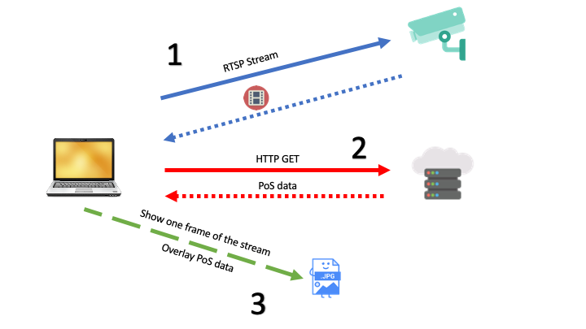

This application can be used if you want to overlay information on top of the video stream of a Meraki MV camera (or any RTSP stream). This program uses OpenCV.

Example use case:
Integration with a POS provider to add an overlay with purchase information in real-time as transactions occur. 

This system will ingest data coming from a web server and plot the text data on top of the image. Here's the overall architecture:

1) Establish the RTSP stream to the camera's local IP;
2) Make an HTTP GET Request to an external web server to download the information that needs to be annotated;
3) Take one frame out of the stream (from step 1), add the data (obtained on step 2) and show the output to the user.
4) Repeat indefinitely (until user closes the program or presses q on the keyboard).

If you like this code or if you have any questions, feel free to reach out:

[LinkedIn](http://linkedin.com/in/rafaelloureirodecarvalho/?locale=en_US)